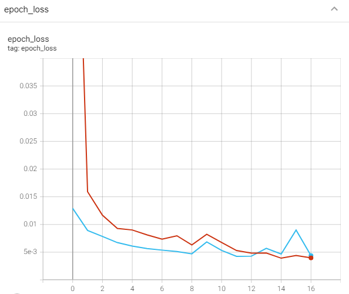

## 
 
 
 
 
 

# Concrete Image Classification
Deep Learning project on how to classify concretes with or without cracks.
 
## Project Description
There are several types of common concrete cracks namely hairline cracks which usually develop in concrete foundation as the concrete cures, shrinkage cracks which
occur while the concrete is curing, settlement cracks which happen when part of concrete sinks or when the ground underneath the slab isn’t compacted properly as well as structural cracks which form due to incorrect design. 

Concrete cracks may endanger the safety and durability of a building if not being identified quickly and left untreated. Hence, this project is to perform image classification to classify concretes with or without cracks. The developed model is impactful and may save thousands of lives. 

### Project Details 
(A). Data Loading  

<ul>
  <li>Define path to the dataset by using os.path.join</em>.</li>
</ul>

(B). Data Preparation  

<ul>
  <li>Define the batch size and image size</li>
  <li>Load the data as TensorFlow dataset</li>
  <li>Split the data into train and validation dataset</li>
  <li>Display some examples of the image to make sure that the dataset is load properly</li>
   
   
</ul>

(C). Data Pre-Processing  

<ul>
  <li>Performing validation-test split</li>
  <li>Split dataset into test and validation by using Tensorflow</li>
  <li>Convert train, validation, and test dataset into prefetch dataset</li>
</ul>

(D). Model Development 

<ul>
  <li>Create a model for image augmentation by using Sequential</li>
  <li>Repeatedly apply the data augmentation on one image and see the result as below:</li>
   
   
   
  <li>Apply Transfer Learning to improve the model accuracy - MobileNetV2</li>
  <ul>
      <li>Create Layer for data Normalization</li>
      <li>Instantiate the pretrained model</li>
      <li>Set the pretrained model as non-trainable (frozen)</li>
       
      
       
      <li>Create the classifier</li>
      <li>Link the layers together to form a pipeline</li>
      <li>Instantiate the full model pipeline</li>
  </ul>
</ul>

(E). Model Compilation  

<ul>
  <li>Compile the model</li>
    <ul>
      <li> Optimizer - adam </li>
      <li> Loss - 'categorical_crossentropy'</li>
      <li> Metrics - 'accuracy'</li>
    </ul>
</ul>

(F). Callbacks - Early Stopping and TensorBoard 

<ul>
  <li>Tensorboard logs after every batch of training to monitor metrics</li>
  <li>Save model to disk</li>
</ul>

(G). Model Training  

<ul>
  <li>Train the model for 10 EPOCHS and get the model accuracy</li>
</ul>

(H). Model Evaluation  

<ul>
  <li>Get the model accuracy and test loss</li>
   
   
   
  <li>Evaluate the model confusion matrix</li>
  <li>Evaluate the model classification report</li>
  <li>Evaluate the model accuracy score</li> 
   
  
</ul>

(I). Model Deployment  

<ul>
  <li>Use model to perform prediction</li>
</ul>

(J). Model Saving

<ul>
  <li>Save the model</li>
    <ul>
      <li>Deep-Learning Model</li>
    </ul>
</ul>

## Results
### TensorBoard Accuracy

  

### TensorBoard Loss

  

## Discussion
From the TensorBoard Loss Graph above, we can conclude that the validation is overfit at the end of the model training, there are several ways on how to solve the model overfitting issues such as:
<ul>
  <li>Adding More Dropout Layers</li>
  <li>Regularization and Ensembling</li>
  <li>Saving best model by using model_checkpoint</li>
</ul>

## Acknowledgement
Special thanks to **(https://data.mendeley.com/datasets/5y9wdsg2zt/2)** for the data source used for this project.
